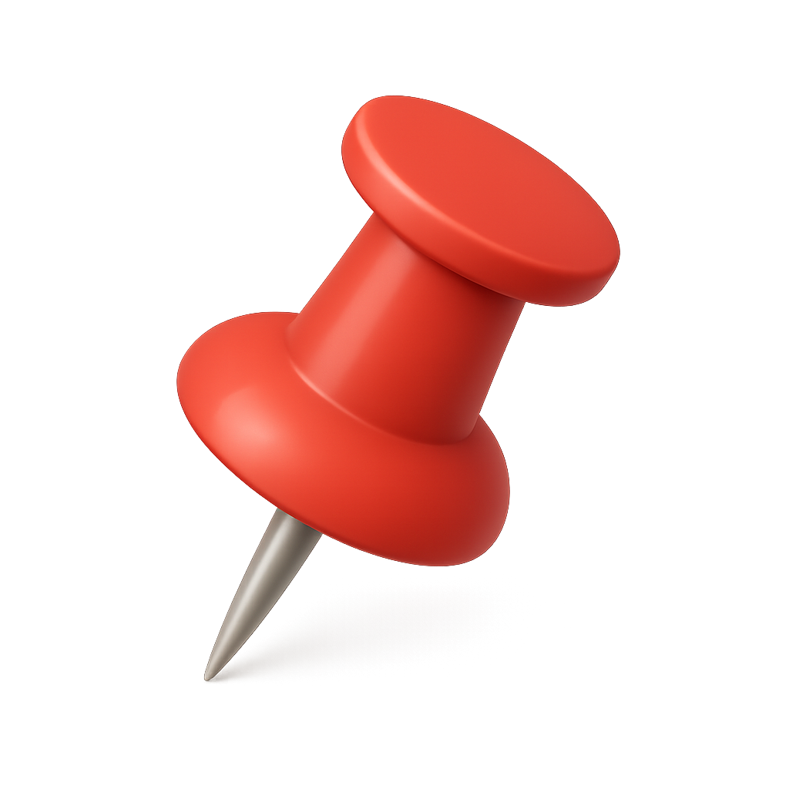

<div align="center">
  
</div>

# Auto Pin Tab

A Chrome extension that automatically pins new tabs as they are created. This extension helps you keep your workspace organized by ensuring new tabs are always pinned and visible at the beginning of your tab bar.

## Features

- 🔧 **Auto-pin new tabs**: Automatically pins all newly created tabs
- ⚙️ **Settings page**: Easy-to-use options page to toggle auto-pin functionality
- 💾 **Persistent settings**: Your preferences are saved and synced across devices
- 🎨 **Modern UI**: Clean, responsive interface built with React and Tailwind CSS

## Installation

### For Developers

1. **Clone the repository**
   ```bash
   git clone <your-repo-url>
   cd pintab
   ```

2. **Install dependencies**
   ```bash
   npm install
   ```

3. **Build the extension**
   ```bash
   npm run build
   ```

4. **Load the extension in Chrome**
   - Open Chrome and navigate to `chrome://extensions/`
   - Enable "Developer mode" in the top right corner
   - Click "Load unpacked" and select the `dist` folder from your project

### For End Users

*Note: This extension is not yet published to the Chrome Web Store. Follow the developer installation steps above.*

## Usage

### Basic Usage
Once installed, the extension works automatically:
- Every new tab you create will be automatically pinned
- Pinned tabs appear at the beginning of your tab bar and are always visible

### Settings
Access the extension settings by:
1. Right-clicking the extension icon in your toolbar
2. Selecting "Options"
3. Or navigate to `chrome://extensions/` and click "Options" under the Auto Pin Tab extension

In the settings page, you can:
- Toggle the auto-pin functionality on/off
- Save your preferences (automatically synced across devices)

## Development

### Tech Stack
- **Framework**: React 19 with TypeScript
- **Build Tool**: Vite
- **Styling**: Tailwind CSS
- **UI Components**: Radix UI primitives
- **Extension API**: Chrome Extension Manifest V3

### Project Structure
```
pintab/
├── src/
│   ├── background.ts      # Service worker for tab management
│   ├── Options.tsx        # Settings page component
│   ├── main-options.tsx   # Options page entry point
│   └── components/        # Reusable UI components
├── public/
│   ├── manifest.json      # Extension manifest
│   └── icon.png          # Extension icon
├── options.html          # Options page HTML
└── index.html           # Main HTML template
```

### Available Scripts

- `npm run dev` - Start development server with hot reload
- `npm run build` - Build the extension for production
- `npm run lint` - Run ESLint for code quality
- `npm run preview` - Preview the built extension

### Development Workflow

1. **Start development server**
   ```bash
   npm run dev
   ```

2. **Make changes** to the source code

3. **Build the extension**
   ```bash
   npm run build
   ```

4. **Reload the extension** in Chrome
   - Go to `chrome://extensions/`
   - Click the refresh icon for your extension

5. **Test your changes** by creating new tabs

### Key Files

- **`src/background.ts`**: Contains the service worker that listens for new tab creation and handles the auto-pin functionality
- **`src/Options.tsx`**: React component for the settings page interface
- **`public/manifest.json`**: Extension configuration and permissions

## Permissions

This extension requires the following permissions:
- `tabs` - To detect new tab creation and pin tabs
- `storage` - To save user settings
- `activeTab` - To interact with the current tab

## Contributing

1. Fork the repository
2. Create a feature branch (`git checkout -b feature/amazing-feature`)
3. Make your changes
4. Run the linter (`npm run lint`)
5. Build the extension (`npm run build`)
6. Test the extension thoroughly
7. Commit your changes (`git commit -m 'Add some amazing feature'`)
8. Push to the branch (`git push origin feature/amazing-feature`)
9. Open a Pull Request

## License

This project is licensed under the MIT License - see the LICENSE file for details.

## Support

If you encounter any issues or have questions:
1. Check the browser console for error messages
2. Ensure you have the latest version of Chrome
3. Try disabling and re-enabling the extension
4. Open an issue in this repository with detailed information about the problem
